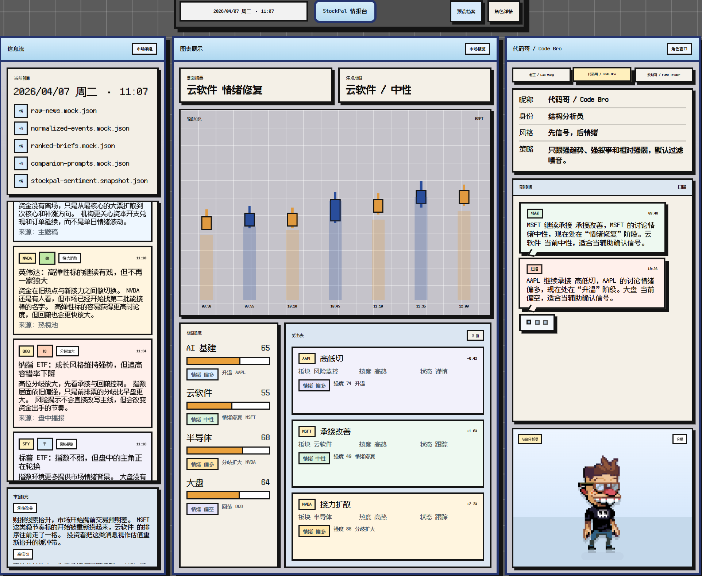

# StockPal

StockPal 是一个偏产品 Demo 形态的「股票情报陪看」Web 应用。  
它不是交易终端，也不是投资建议工具，而是一套面向个人投资者的轻量化市场观察界面：

- 左侧展示市场快讯流
- 中间展示图表、板块热度和关注表
- 右侧展示不同人格的 AI companion 陪看评论

当前版本已经重构为统一的像素风三窗格桌面 HUD，并接入了离线 BERT 情绪信号，用来增强中栏和右栏的内容表现。

## 项目预览



## 当前版本定位

这一版是一个 **稳定、可演示、可继续扩展** 的 mock-first 产品原型，重点不在真实交易能力，而在以下几件事：

- 产品界面和信息架构是否成立
- 多源信息能否被整理成统一盘面
- companion 评论是否能围绕具体事件和情绪信号展开
- 架构上是否预留了后续接入真实 provider 的位置

## 当前已实现能力

### 1. 像素风首页重构

- 首页为固定首屏高度的三窗格结构
- 顶部是像素风 HUD 状态栏
- 左栏为市场信息流与补充摘要
- 中栏为伪行情图、板块热度和关注表
- 右栏为 companion 角色卡、聊天窗和像素角色展示

### 2. mock-first 市场内容链路

首页当前通过本地内容层驱动，但不是简单写死几条文案，而是走一条结构化链路：

`raw news -> normalize -> rank -> sentiment merge -> companion generation -> render`

具体包括：

- 原始财经事件输入
- 新闻归一化与标签化
- 焦点排序与盘面提炼
- 离线情绪信号融合
- 角色化评论生成
- 前端展示

### 3. 离线 BERT 情绪信号接入

项目保留了一个独立的 Python `bert/` 模块，来自你之前的中文股民评论情绪分析项目。  
当前版本没有把 BERT 直接塞进 Next.js 运行时，而是采用更稳的离线接入方式：

- Python 侧导出结构化 JSON 快照
- Next.js 服务端读取该快照
- 若快照缺失，则自动回退到 mock sentiment

目前离线情绪信号已经用于：

- 中栏关注表中的股票级情绪标签
- 中栏板块热度中的板块级情绪趋势
- 右栏 companion 对当前盘面的针对性评论

### 4. 角色化 companion 系统

当前内置 3 个 companion：

- `老王 / Lao Wang`：稳健、风险优先、偏保守
- `代码哥 / Code Bro`：结构化、逻辑化、先信号后情绪
- `发财哥 / FOMO Trader`：情绪强、热点敏感、戏剧化表达

同一组市场事件和情绪信号，在 3 个 companion 下会生成不同风格的评论。

## 页面结构

### 首页 `/`

首页是当前项目最核心的展示页面。

- 左栏：市场快讯、来源文件、补充摘要
- 中栏：盘面摘要、焦点板块、伪行情图、板块热度、关注表
- 右栏：角色切换、角色资料、聊天式评论窗、像素角色展示

### 角色详情页 `/companion`

用于展示当前 companion 的更完整档案，包括：

- 角色身份
- 风格与策略
- 行为状态
- 历史播报

### 预设档案页 `/onboarding`

当前为轻量入口页，主要保留项目结构完整性，不是当前版本的主体验入口。

## 技术栈

- Next.js App Router
- React
- TypeScript
- Tailwind CSS
- 自定义像素风 CSS UI 系统
- 本地 mock provider / scenario content
- Python BERT 离线情绪模块

## 本地运行

### 安装依赖

```bash
npm install
```

### 启动开发环境

```bash
npm run dev
```

启动后打开：

```text
http://localhost:3000
```

如果你在 Windows PowerShell 下遇到脚本策略问题，可以改用：

```powershell
npm.cmd run dev
```

## 离线 BERT 模块说明

`bert/` 目录保留了你之前的中文股民评论情绪分析代码，包括：

- 训练脚本
- 推理脚本
- Streamlit 演示脚本
- 样例输出文件

当前 StockPal 使用的是离线导出结果，而不是在线推理。

### 当前示例快照

- [bert/exports/stockpal-sentiment.snapshot.json](./bert/exports/stockpal-sentiment.snapshot.json)

### 导出脚本

- [bert/export_stockpal_sentiment.py](./bert/export_stockpal_sentiment.py)

### 示例导出方式

```bash
cd bert
python export_stockpal_sentiment.py --config stockpal_export_config.example.json
```

### 仓库策略

- `bert/model.pth` 仅本地保留，不纳入 Git
- 前端只消费导出的结构化快照
- 如果快照缺失，项目仍能正常运行

## 项目结构

```text
app/
  api/
  companion/
  onboarding/
components/
  HomeScreen.tsx
  InfoFeedPanel.tsx
  MarketDisplayPanel.tsx
  CompanionPanel.tsx
lib/
  market-home.ts
  market-feed.ts
  market-snapshot.ts
  sentiment-provider.ts
  news-normalizer.ts
  news-ranker.ts
  companion-generator.ts
  demo-content.ts
bert/
  export_stockpal_sentiment.py
  exports/
docs/
  stockpal-dashboard.png
```

## 当前数据流

当前首页统一通过 `/api/market-home` 获取数据，后端聚合逻辑大致如下：

1. 读取 mock 原始市场内容
2. 做新闻归一化和排序
3. 读取离线 BERT 情绪快照
4. 生成中栏盘面数据
5. 生成右栏 companion 评论
6. 返回首页完整 payload

这意味着即使现在还是 demo 数据，整个项目也已经具备比较清晰的 provider / pipeline 结构，而不是纯静态页面。

## 当前限制

当前版本仍然是 demo-first，存在以下边界：

- 不接真实股票行情 API
- 不接真实财经新闻 API
- 不接 OpenAI 在线生成
- 不做认证和用户持久化
- 图表是轻量伪行情，不是专业交易图

但这些位置在架构上都已经预留了替换空间。

## 后续可扩展方向

- 接入真实新闻源与 quote provider
- 把离线 BERT 升级为可定期批处理的情绪信号管线
- 接入 LLM 生成更丰富的 companion 评论
- 增加用户档案、偏好和 watchlist 持久化
- 扩展为更完整的 AI stock companion / market intelligence demo

## 项目说明

StockPal 当前更适合作为：

- 前端产品 Demo
- 数据管线与信息架构展示项目
- AI + 数据产品方向的作品集项目

它展示的核心不是“我接了多少真实 API”，而是：

- 我如何把分散信息整理成产品界面
- 我如何设计可扩展的数据和生成层
- 我如何把情绪信号、角色评论和可视化组织成一个完整体验

## 免责声明

本项目仅用于产品设计、前端实现和数据原型展示，不构成任何投资建议。
